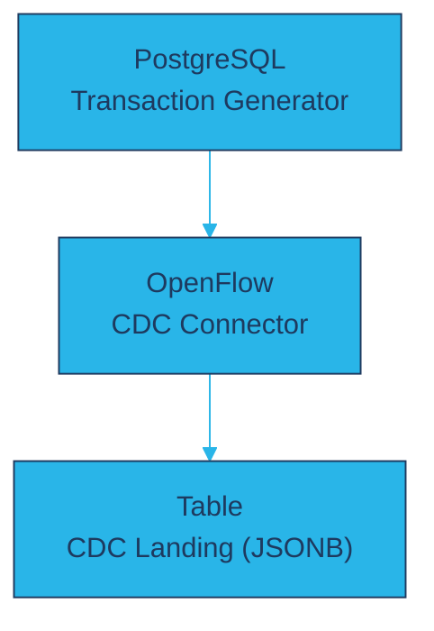
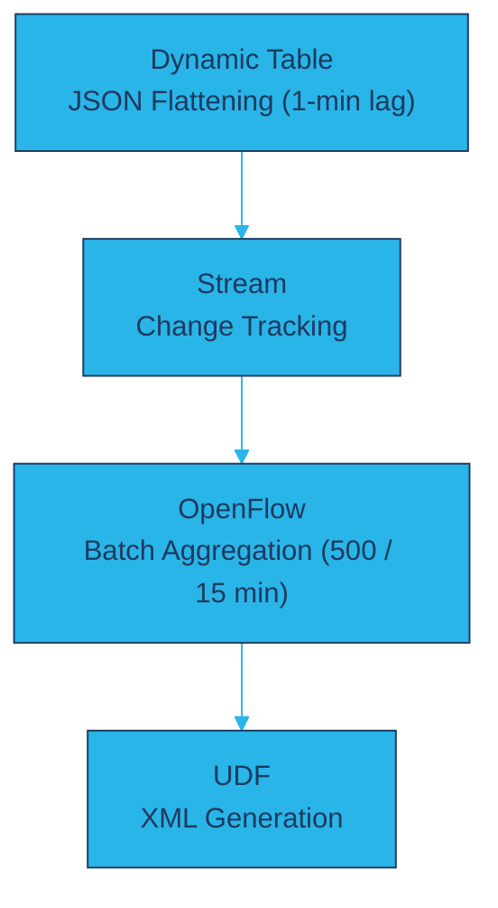
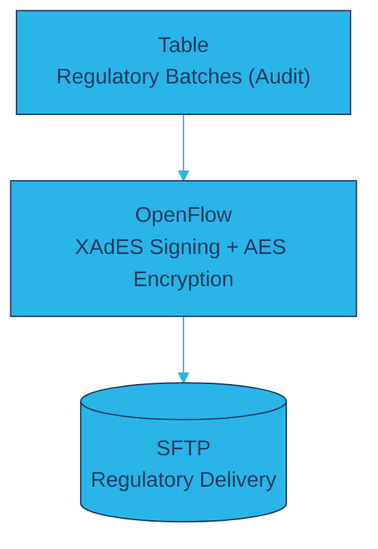
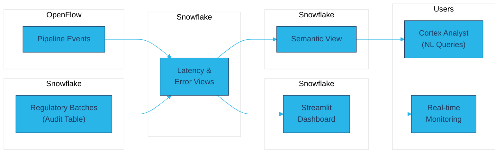

# BOE Gaming Report - Regulatory Compliance Demo

**Proof-of-concept:** Snowflake Cortex + Snowflake OpenFlow (Apache NiFi) implementation of Spanish gaming regulation BOE-A-2024-12639.

---

## What This Is

**BOE-A-2024-12639** is a Spanish government regulation (published June 22, 2024) that defines comprehensive technical requirements for gaming operators to report activity to **DGOJ** (Dirección General de Ordenación del Juego - Spanish Gaming Regulator).

The regulation specifies:
- Real-time, daily, and monthly reporting across 6 information categories (12 subtypes, 29 game types)
- Strict security requirements: XAdES-BES 1.3.2 digital signatures, AES-256 encryption
- Specific XML structure, file naming, and directory hierarchy
- SFTP delivery to government warehouse

**This demo proves** that Snowflake + OpenFlow can handle these complex regulatory requirements, from specification extraction through secure delivery.

**Target audience:** Gaming operators, regulators, developers evaluating Snowflake for compliance workflows.

---

## What This Demonstrates

This demo proves that Snowflake and OpenFlow can handle the complex technical requirements for Spanish gaming regulatory compliance:

- ✅ **XAdES-BES 1.3.2 digital signatures** with SHA-256 hashing
- ✅ **AES-256 ZIP encryption** with 50-character passwords
- ✅ **Deflate compression** per WinZip specification
- ✅ **Automated SFTP delivery** to regulatory warehouse
- ✅ **Proper file naming and directory structure** per BOE spec
- ✅ **Complete audit trail** in Snowflake with status tracking
- ✅ **XSD validation** against official DGOJ schema
- ✅ **AI-powered specification extraction** using Snowflake Cortex AI

---

## Specification Extraction with Snowflake AI

**The technical specifications for this demo were extracted directly from the BOE regulatory PDF using Snowflake's native AI capabilities.**

### Extraction Workflow

```
BOE-A-2024-12639.pdf (Spanish, 80 pages)
    ↓
AI_PARSE_DOCUMENT (Document AI with LAYOUT mode)
    ↓
Structured English Text (~167K characters)
    ↓
CORTEX.COMPLETE (Claude Sonnet 4.5, comprehensive extraction)
    ↓
Technical Specifications (JSON + Markdown)
    ↓
Demo Implementation (Simplified scope: Poker Tournament real-time reporting)
```

### AI Capabilities Demonstrated

- 📄 **Document AI (`AI_PARSE_DOCUMENT`)** - Converted 80-page Spanish PDF to structured English text with preserved layout
- 🤖 **Cortex AI (`COMPLETE`)** - Extracted comprehensive specifications without predefined search terms
- ✅ **Validation** - Multi-stage validation (JSON parsing, truncation detection, closing brace checks)
- 📊 **Structured Output** - JSON stored in Snowflake VARIANT for querying, markdown for documentation
- 🔄 **Reproducible** - Entire workflow in SQL, can be re-run on document updates

### Extracted Specifications

The AI extracted 65+ specification items across 17 categories:
- Digital Signature (XAdES-BES 1.3.2, SHA-256)
- Encryption & Compression (AES-256, Deflate)
- File Naming Conventions (6 patterns)
- Directory Structure (5-level hierarchy)
- Batch Generation Rules (15 min / 500 subrecords)
- Data Retention (4 years, 12 months online)
- Field Types & Validation Rules
- Enumerated Code Sets (84 sports, 15 payment methods, etc.)

### From Full Specs to Demo

The full specifications define 6 information categories (12 subtypes) and 29 game types across daily, monthly, and real-time periodicities. This demo implements a **simplified scope** to prove the technical model:

- **Full Spec:** 6 info categories/12 subtypes, 29 game types, 3 periodicities
- **Demo Scope:** 1 information type (JUC), 1 game type (Poker Tournament - POT), real-time only
- **Technical Implementation:** 100% compliant (all signature, encryption, naming, structure requirements)

**Documentation:**
- [`specifications/01_extract_specifications.sql`](specifications/01_extract_specifications.sql) - Executable SQL extraction workflow
- [`specifications/02_FULL_SPECIFICATIONS.md`](specifications/02_FULL_SPECIFICATIONS.md) - Complete AI-extracted specs (65+ items)
- [`specifications/03_EXTRACTION_ASSESSMENT.md`](specifications/03_EXTRACTION_ASSESSMENT.md) - Quality assessment and validation
- [`specifications/04_DEMO_SPECIFICATIONS.md`](specifications/04_DEMO_SPECIFICATIONS.md) - Demo-scoped implementation guide
- [`specifications/05_COMPLIANCE.md`](specifications/05_COMPLIANCE.md) - **What's implemented vs what's not** (Full spec differential)

---

## Architecture

### Data Pipeline

<table>
<tr>
<td align="center"><b>Bronze (Ingestion)</b></td>
<td align="center"><b>Silver (Processing)</b></td>
<td align="center"><b>Gold (Delivery)</b></td>
</tr>
<tr>
<td valign="top">



</td>
<td valign="top">



</td>
<td valign="top">



</td>
</tr>
</table>

### Observability



### Pipeline Flow

| Stage | Component | Purpose |
|-------|-----------|---------|
| **Source** | PostgreSQL (GAMING_TXNS) | OLTP transaction generation |
| **Replication** | OpenFlow CDC Connector | Near-real-time CDC to Snowflake |
| **Transform** | Dynamic Table | Flattens JSON, 1-minute lag |
| **Track** | Stream | Identifies unprocessed rows |
| **Batch** | OpenFlow Batch Processing | 500 records / 15 min batching, XML generation |
| **Secure** | OpenFlow Boe Gaming Report | XAdES-BES signing, AES-256 encryption |
| **Deliver** | AWS Transfer Family | SFTP to regulatory warehouse |
| **Monitor** | Semantic View + Streamlit | Cortex Analyst queries, real-time dashboard |

**Key Design Decisions:**
- **Snowflake Postgres** as OLTP source enables realistic CDC patterns without external infrastructure
- **Dynamic Table with 1-min lag** balances freshness against compute cost
- **Stream on Dynamic Table** enables exactly-once processing semantics
- **OpenFlow for security** handles XAdES-BES and AES-256 requirements that Snowflake cannot natively address
- **Semantic View** enables natural language queries without exposing underlying table complexity

---

## Quick Start

### Choose Your Path

**Option A: Extract Specifications First** (Exploratory)
1. Run [`specifications/01_extract_specifications.sql`](specifications/01_extract_specifications.sql) to extract specs from the PDF using Snowflake AI
2. Review the generated specifications in `specifications/02_FULL_SPECIFICATIONS.md`
3. Then proceed with the demo setup below

**Option B: Deploy the Demo** (Direct)
1. Skip the extraction step and use the provided specifications
2. Follow the setup guides below

Both paths work independently - the extraction SQL includes `CREATE IF NOT EXISTS` statements so there's no conflict.

---

### Demo Setup

Documentation (located in `setup/`):

1. **[01_ARCHITECTURE.md](setup/01_ARCHITECTURE.md)** - System overview and data flow
2. **[02_DEPLOYMENT.md](setup/02_DEPLOYMENT.md)** - Deployment steps and verification
3. **[03_INFRASTRUCTURE_INVENTORY.md](setup/03_INFRASTRUCTURE_INVENTORY.md)** - Complete object reference

SQL deployment scripts (located in `sql/`):

- **[sql/README.md](sql/README.md)** - Script execution order and methods
- Numbered SQL scripts (00-09) for complete deployment


---

## What's Implemented

### Demo Flow

This demo simulates a complete regulatory reporting cycle:

1. **Generate Test Data** - Insert sample poker tournament transactions into Snowflake (JSON format with player IDs, bet amounts, win amounts)
2. **Batch Aggregation** - Snowflake procedure aggregates last 15 minutes of transactions into regulatory batches
3. **XML Generation** - SQL function transforms JSON data into compliant XML structure per DGOJ XSD
4. **Audit Trail** - Batch metadata stored in `regulatory_batches` table with status 'READY'
5. **OpenFlow Polling** - OpenFlow queries Snowflake every minute for batches with status = 'READY'
6. **Security Processing** - OpenFlow applies XAdES-BES signature, Deflate compression, AES-256 encryption
7. **SFTP Delivery** - Encrypted files uploaded to AWS Transfer Family with proper directory structure
8. **Status Update** - OpenFlow updates Snowflake batch status to 'UPLOADED'

### Report Type
- **JUC** - Juegos en Curso (Real-time Game Registers)
- **Game Type:** POT (Poker Tournament)
- **Frequency:** 15-minute batching, 1-minute polling

### Compliance Status

| Requirement | Status | Notes |
|-------------|--------|-------|
| XML Structure | ⚠️ Simplified | Minimal valid structure with transaction data - see [05_COMPLIANCE.md](specifications/05_COMPLIANCE.md) |
| File Naming | ✅ Compliant | `OP01_ALM01_JU_JUC_POT_YYYYMMDDHHMMSS_ID.zip` |
| Directory Structure | ✅ Compliant | `CNJ/OP01/JU/YYYYMMDD/POT/` |
| Digital Signature | ✅ Compliant | XAdES-BES 1.3.2, SHA-256 |
| Compression | ✅ Compliant | ZIP with Deflate |
| Encryption | ✅ Compliant | AES-256 (WinZip-compatible) |
| Batch Frequency | ✅ Compliant | 15-minute aggregation windows |
| XSD Namespace | ✅ Compliant | `http://cnjuego.gob.es/sci/v3.3.xsd` |
| XSD Validation | ✅ Passes | Validates against official DGOJ schema |

**Scope:** The XML includes actual transaction data (player IDs, bet/win amounts) but uses a simplified field set for proof-of-concept. Production requires complete tournament metadata and additional player fields per DGOJ XSD. See [05_COMPLIANCE.md](specifications/05_COMPLIANCE.md) for the full specification differential.

---

## Project Structure

### Source Documents (`source_documents/`)
- `BOE-A-2024-12639.pdf` - Spanish regulatory PDF (80 pages, original source)
- `DGOJ_Monitorizacion_3.3.xsd` - Official XSD validation schema (v3.3)

### Specifications (`specifications/`)
Complete workflow from PDF to implementation specs:
- `01_extract_specifications.sql` - Snowflake AI extraction workflow
- `02_FULL_SPECIFICATIONS.md` - Complete extraction (65+ items, 17 categories)
- `03_EXTRACTION_ASSESSMENT.md` - Quality validation and analysis
- `04_DEMO_SPECIFICATIONS.md` - Demo-scoped implementation guide
- `05_COMPLIANCE.md` - Full spec vs Demo differential

### Setup Guides (`setup/`)
- `01_ARCHITECTURE.md` - System overview and data flow
- `02_DEPLOYMENT.md` - Deployment steps and verification
- `03_INFRASTRUCTURE_INVENTORY.md` - Object reference
- `FLOW_PARAMETERS.md` - OpenFlow parameter structure

### SQL Scripts (`sql/`)
Deployment scripts for Snowflake objects:
- `README.md` - Execution order and methods
- `run_sql.sh` - Wrapper script for consistent execution
- `00-09_*.sql` - Numbered scripts (database, grants, tables, functions, etc.)

### Implementation
- `flow/BoeGamingReport.json` - OpenFlow flow definition
- `custom_processors/PrepareRegulatoryFile/` - Custom Python processor for XAdES-BES signing
- `credentials/` - Generated security credentials (excluded from git)

---

## Technical Highlights

**Snowflake:**
- SQL-based XML generation with actual transaction data
- Iterates over all transactions in batch using FLATTEN() and LISTAGG()
- JSON source data preservation for audit trail
- Complete lifecycle tracking (READY → UPLOADED)
- Parameterized database/schema for flexibility
- Batch metadata generation (filenames, paths per spec)

**Custom Processor (PrepareRegulatoryFile):**
- XAdES-BES signature using signxml library
- WinZip-compatible AES-256 encryption using pyzipper
- Deflate compression
- Thin NAR (~4KB) with dependencies installed from PyPI on first load

**OpenFlow Flow:**
- 1-minute polling (picks up batches immediately)
- XSD validation against DGOJ schema
- Automated SFTP delivery with directory creation
- Error handling with complete attribute logging
- Status feedback to Snowflake

---

## Demo Scope and Limitations

### What This Is

- ✅ Technical proof-of-concept for security and delivery pipeline
- ✅ Focuses on signature, encryption, and automated SFTP delivery
- ✅ Shows Snowflake + OpenFlow integration
- ✅ Complete end-to-end workflow with audit trail

### What This Isn't

- ❌ Production-ready data model (XML intentionally simplified)
- ❌ Multiple report types (only JUC/POT implemented)
- ❌ CA-issued certificates (demo uses self-signed)
- ❌ Actual DGOJ server (AWS Transfer Family substitutes)
- ❌ Complete error handling and monitoring

**Use Case:** Demonstrate technical feasibility and platform capabilities for regulatory compliance requirements.

---

## Resources

### Spanish Gaming Regulation
- **BOE Official PDF:** [BOE-A-2024-12639 (June 22, 2024)](https://www.boe.es/buscar/pdf/2024/BOE-A-2024-12639-consolidado.pdf)
- **DGOJ Website:** https://www.ordenacionjuego.es
- **XSD Schema:** https://www.ordenacionjuego.es/search/node?keys=xsd

### Technical Standards
- **XAdES-BES:** XML Advanced Electronic Signatures
- **WinZip AES:** http://www.winzip.com/aes_info.htm
- **XML Digital Signature:** http://www.w3.org/TR/xmldsig-core/

### Snowflake
- **OpenFlow:** https://docs.snowflake.com/en/user-guide/data-integration/openflow/about

---

## License

Licensed under the Apache License, Version 2.0. See [LICENSE](LICENSE) for details.

This is a demonstration project. Production use requires appropriate DGOJ licensing and certification.

---

**Last Updated:** February 2026
